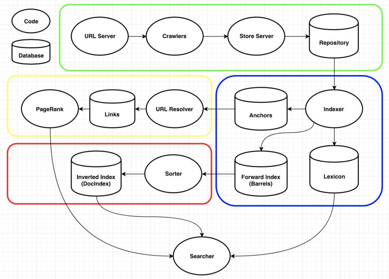

# Google Architecture 2

This is the second part of a series, explaining Google's Architecture in great detail and implementing it in Golang.

## Brief description

This project is based on [this original Google paper](http://infolab.stanford.edu/pub/papers/google.pdf), also called just google.pdf.
It describes Google's Architecture in its early days, which looked kind of like this:

